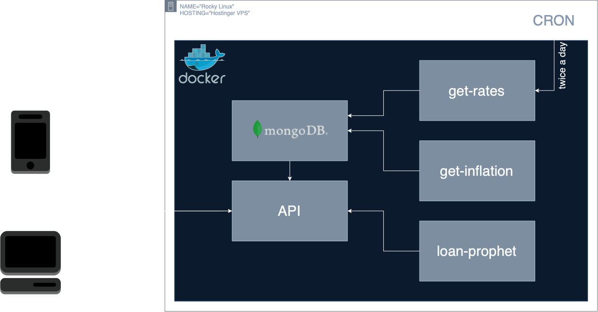

# Financier

## 🇬🇧 Engineering Bachelor Thesis - Web Application for Long-Term Financial Decision-Making
## 🇵🇱 Temat Pracy Inżynierskiej - Aplikacja webowa wspierająca podejmowanie długoterminowych decyzji finansowych

**Financier** is a web application developed as part of my Bachelor Thesis, designed to assist users in making informed long-term financial decisions. This project aims to provide valuable insights and tools for effective financial planning and management.

<span style="font-weight: bold;font-size: 1.5em;color: lightblue;">The thesis</span> based on this application was awarded the <span style="font-weight: bold;font-size: 1.5em;color: lightblue;">highest possible</span> grade of <span style="font-weight: bold;font-size: 1.5em;color: lightblue;">5</span> at Polish universities. Additionally, <span style="font-weight: bold;font-size: 1.5em;color: lightblue;">the defense</span> was rated <span style="font-weight: bold;font-size: 1.5em;color: lightblue;">5.5</span>, also the <span style="font-weight: bold;font-size: 1.5em;color: lightblue;">highest</span> score attainable for this stage.

I <span style="font-weight: bold;font-size: 1.5em;color: lightblue;">graduated with distinction</span>, achieving an overall grade of <span style="font-weight: bold;font-size: 2.5em;color: lightblue;">6</span>.
___
# Development process
## Current stage
I decided to develop the app more in order to learn more about DevOps and CI-CD concepts. Hopefully my resolve will lead me to extending the app into fully automatic CI-CD pipeline, but the current goal is:
- Organising loosely-connected containers using <span style="font-weight: bold;font-size: 1.5em;color: lightblue;">docker compose</span> 

## First stage
At the time when Financier was being submitted as part of my Engineering Thesis it was a couple of loosely connected containers with fully manual deployment process. Whole implementation looked like this:



<details>
<summary>Manual deployment process</summary>

1. Enable Docker
	```bash
	sudo systemctl enable docker
	```
2. Run MongoDB:
	```bash
	docker run -d \
		--name financier-mongo \
		--env-file ./enviromental.txt \
		-v mongodbdata:/data/db \
		mongo:7.0.6
	```
3. Build and Run GetRates:
	```bash
	docker build -t get-rates ./get-rates-app/
	docker run -d --rm \
		--name financier-get-rates \
		--env-file ./enviromental.txt \
		--env-file ./get-rates-app/enviromental.txt \
		get-rates
	```
4. Build and Run GetInflation:
	```bash
	docker build -t get-inflation . # run inside script folder
	docker run -d --rm \
		--name financier-get-inflation \
		--env-file ./enviromental.txt \
		get-inflation
	```
5. Build and Run LoanProphet:
	```bash
	docker build -t loan-prophet ./approve-model/
	docker run -d --rm \
		-v /PRODUCTION/Financier/app/package/:/model/package \
		loan-prophet
	```
6. Build and Run FinancierAPI:
	```bash
	docker build -t financier-api ./app
	docker run -d \
		-p 80:8080 \
		--env-file ./enviromental.txt \
		--name financier-api_container \
		financier-api
	```
___
## Useful snippets:
Login to MongoDB:
```bash
mongosh --username <username> --password <password>
```
</details>

#### Importat details:
Created volume to make data persistant inside MongoDB:
```bash
docker volume create mongodbdata
```
Added `financier-get-rates.sh` to /etc/cron.daily/

___  
Used icons:
<a href="https://www.flaticon.com/" title="currency icons">Icons created by Freepik - Flaticon</a>  
Inflation data:
<a href="https://en.wikipedia.org/wiki/ISO_4217">Wikipedia data</a>